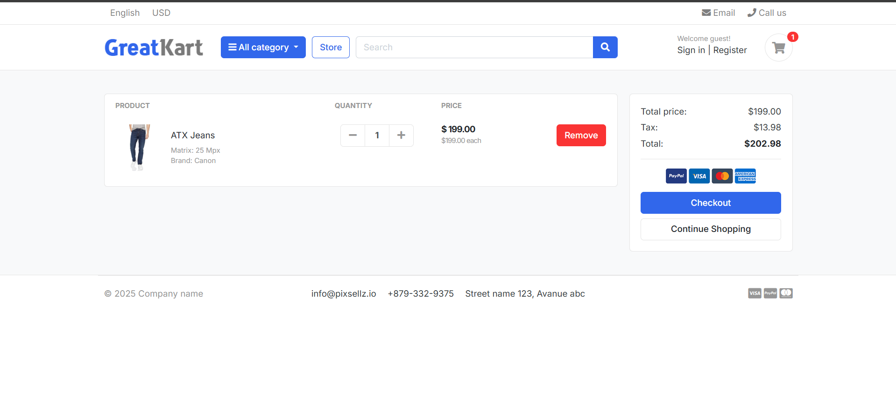
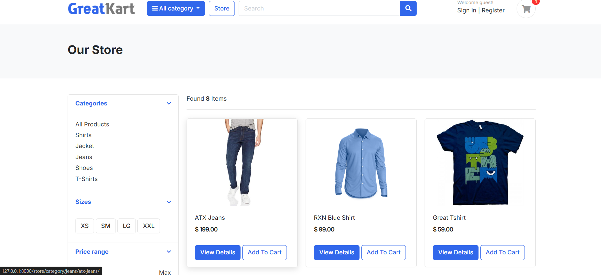

# 🛒 QuickCart - Django eCommerce Application

QuickCart is a full-featured eCommerce web application built with the **Django Framework (Python)**. This project showcases core eCommerce functionality, modern UI interactions, and backend best practices, making it an ideal starting point for building scalable online stores.

## 🚀 Features

### 👤 User Management
- Custom user model with email authentication
- Full "My Account" dashboard for customers
- Profile editing with profile picture upload
- Change password functionality

### 🛍️ Product Management
- Unlimited product image gallery per item
- Product categories and subcategories
- Inventory management (auto-decrease stock on purchase)

### 🛒 Cart & Checkout
- Add, remove, increment, and decrement cart items
- Persistent cart system per user session
- Real-time price calculation
- Coupon and discount logic (optional to add)

### 💸 Payments & Orders
- Integrated **Razorpay** for secure online payments
- Order summary and checkout process
- Automatic stock deduction after order completion
- Order confirmation email sent to customer
- PDF Invoice generation for orders
- Order success/thank you page

### ⭐ Reviews & Ratings
- Product review system
- Interactive star rating (supports half-star ratings)

### 🔐 Security
- **Honeypot** protection for admin login
- Django's built-in protections (CSRF, SQLi, XSS, etc.)

## 🧰 Tech Stack

- **Backend**: Python, Django
- **Frontend**: HTML5, CSS3, JavaScript
- **Database**: PostgreSQL
- **Payment Gateway**: Razorpay
- **Security**: Django Honeypot, CSRF protection, strong user auth
  
## 📸 Project Preview





## 1. Install required softwares
> 🐍 Python version
- 3.12.3

> 📂 PostgreSQL version
- psql (PostgreSQL) 16.6 (Ubuntu 16.6-0ubuntu0.24.04.1)
  
## 2. Clone the Repository
```bash
git clone https://github.com/shubhankarchdas/QuickCart.git
cd QuickCart
```
## 3.⚙️ Setup Instructions

- create a virtual environment :
```bash
python -m venv venv
```
## 4. Activate scripts :
```bash
venv/scripts/activate
```
## 5. Install Requirements :
```bash
pip install -r requirements.txt
```
## ⚠️ Sample Environment Variables for QuickCart Django Project
    # DEBUG
    DEBUG=True
    
    # SECRET KEY
    SECRET_KEY=<YOUR SECRET KEY>
    
    # SMTP
    EMAIL_BACKEND=django.core.mail.backends.smtp.EmailBackend
    EMAIL_HOST=smtp.gmail.com
    EMAIL_PORT=587
    DEFAULT_FROM_EMAIL=<youremail@gmail.com>
    EMAIL_USE_TLS=True
    
    # SESSION 
    SESSION_ENGINE=django.contrib.sessions.backends.db
    SESSION_COOKIE_NAME=sessionid
    SESSION_COOKIE_SECURE=False  # Set to True if using HTTPS, otherwise False for local development
    SESSION_COOKIE_AGE=1209600  # 2 weeks, or adjust as needed
    SESSION_EXPIRE_AT_BROWSER_CLOSE=False  # Keeps session open after browser close if False
    
    # EMAIL
    EMAIL_ID=<youremail@gmail.com>
    EMAIL_PASSWORD=<yourstrongpassword>
    
    # DB
    DATABASE_NAME=<your database name>
    DATABASE_USER=<your database username>
    DATABASE_PASSWORD=<your database password>
    DATABASE_HOST=localhost
    DATABASE_PORT=5432 # change if needed

## 6. Make migrations:
```bash
python manage.py makemigrations 
python manage.py migrate
```

(if having some error of psycopg2 then )

    pip install psycopg2 binary

# redo :  
    
    python manage.py makemigrations 
    python manage.py migrate

## 7. open runserver:
```bash
python manage.py runserver
```
